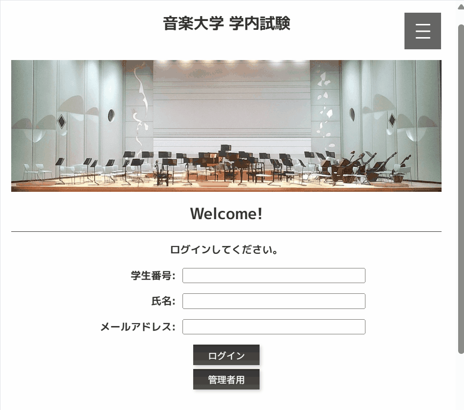
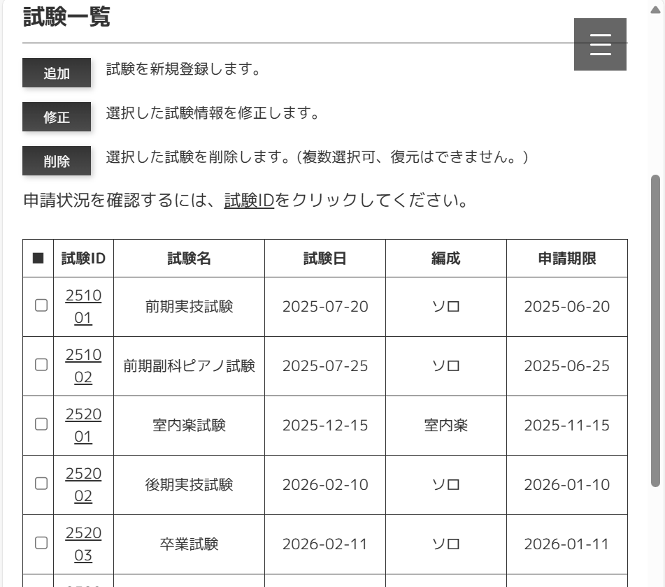

# 🎶ExamGate - 音大試験申請Webアプリケーション

## ✏️概要

音楽大学の学内実技試験へ、オンラインから申請できるWebアプリケーションです。

## 📌機能

- ログイン／ログアウト
- 申請フォームから対象試験へ申請
- 申請情報の確認

 

管理者による操作：
- 学生情報の確認・追加・削除
- 試験情報の確認・追加・削除
- 申請状況と内容の確認

## 🔧開発環境

- 言語：Java 21, HTML, CSS, JavaScript, SQL
- フレームワーク：Spring Boot 3.4.5
- テンプレートエンジン：Thymeleaf
- ビルドツール：Maven
- データベース：H2(ファイルモード)
- IDE：Eclipse 2023-12
- 実行環境：Windows 10 / AWS EC2(Ubuntu)

## 🎦アプリ動作のデモ

実際の操作画面のGIFです。

#### ログイン～各画面への遷移

#### 試験申請

#### 管理者用の画面操作

#### 試験の申請状況の一覧、申請内容の詳細表示

## 💬工夫したところ、難しかったところ

- 操作時に無駄や不便がないように、画面遷移やセッション管理を工夫。
- フロントエンドの勉強不足から、連携や表示が意図通りにできずに苦労した。

## 💡今後追加したい機能

- 申請完了メールの自動送信(申請者・未申請者への通知)
- 締切日時の設定機能(期限後は申請不可にする)
